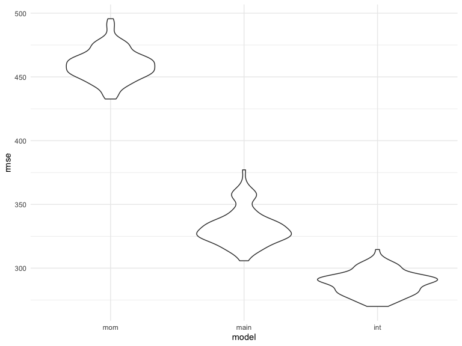

Homework 6
================
Matthew Parker
2019-11-19

## Problem 1

Read in and clean data

``` r
bw_df = 
  read_csv("./data/birthweight.csv") %>% 
  janitor::clean_names() %>% 
  mutate(
    babysex = factor(
      recode(
        babysex, 
        "1" = "Male", 
        "2" = "Female"
      )
    ),
    frace = factor(
      recode(
        frace, 
        "1" = "White", 
        "2" = "Black", 
        "3" = "Asian", 
        "4" = "Puerto Rican",
        "8" = "Other",
        "9" = "Unkown"
      )
    ),
    malform = factor(
      recode(
        malform,
        "0" = "absent",
        "1" = "present"
      )
    ),
    mrace = factor(
      recode(
        mrace,
        "1" = "White", 
        "2" = "Black", 
        "3" = "Asian", 
        "4" = "Puerto Rican",
        "8" = "Other"
      )
    )
  )
```

The above code reads in the csv file, and coverts certain variable to
factors with informative levels.

Check for missing values and look at distribution of variables

``` r
skimr::skim(bw_df) 
```

    ## Skim summary statistics
    ##  n obs: 4342 
    ##  n variables: 20 
    ## 
    ## ── Variable type:factor ───────────────────────────────────────────────────────────────────────────────────────────────────────────────────────
    ##  variable missing complete    n n_unique
    ##   babysex       0     4342 4342        2
    ##     frace       0     4342 4342        5
    ##   malform       0     4342 4342        2
    ##     mrace       0     4342 4342        4
    ##                               top_counts ordered
    ##              Mal: 2230, Fem: 2112, NA: 0   FALSE
    ##  Whi: 2123, Bla: 1911, Pue: 248, Asi: 46   FALSE
    ##                abs: 4327, pre: 15, NA: 0   FALSE
    ##  Whi: 2147, Bla: 1909, Pue: 243, Asi: 43   FALSE
    ## 
    ## ── Variable type:numeric ──────────────────────────────────────────────────────────────────────────────────────────────────────────────────────
    ##  variable missing complete    n      mean     sd     p0     p25     p50
    ##     bhead       0     4342 4342   33.65     1.62  21      33      34   
    ##   blength       0     4342 4342   49.75     2.72  20      48      50   
    ##       bwt       0     4342 4342 3114.4    512.15 595    2807    3132.5 
    ##     delwt       0     4342 4342  145.57    22.21  86     131     143   
    ##   fincome       0     4342 4342   44.11    25.98   0      25      35   
    ##   gaweeks       0     4342 4342   39.43     3.15  17.7    38.3    39.9 
    ##  menarche       0     4342 4342   12.51     1.48   0      12      12   
    ##   mheight       0     4342 4342   63.49     2.66  48      62      63   
    ##    momage       0     4342 4342   20.3      3.88  12      18      20   
    ##    parity       0     4342 4342    0.0023   0.1    0       0       0   
    ##   pnumlbw       0     4342 4342    0        0      0       0       0   
    ##   pnumsga       0     4342 4342    0        0      0       0       0   
    ##     ppbmi       0     4342 4342   21.57     3.18  13.07   19.53   21.03
    ##      ppwt       0     4342 4342  123.49    20.16  70     110     120   
    ##    smoken       0     4342 4342    4.15     7.41   0       0       0   
    ##    wtgain       0     4342 4342   22.08    10.94 -46      15      22   
    ##      p75   p100     hist
    ##    35      41   ▁▁▁▁▅▇▁▁
    ##    51      63   ▁▁▁▁▁▇▁▁
    ##  3459    4791   ▁▁▁▃▇▇▂▁
    ##   157     334   ▁▇▅▁▁▁▁▁
    ##    65      96   ▁▂▇▂▂▂▁▃
    ##    41.1    51.3 ▁▁▁▁▃▇▁▁
    ##    13      19   ▁▁▁▁▂▇▁▁
    ##    65      77   ▁▁▁▅▇▂▁▁
    ##    22      44   ▂▇▅▂▁▁▁▁
    ##     0       6   ▇▁▁▁▁▁▁▁
    ##     0       0   ▁▁▁▇▁▁▁▁
    ##     0       0   ▁▁▁▇▁▁▁▁
    ##    22.91   46.1 ▁▇▅▁▁▁▁▁
    ##   134     287   ▁▇▆▁▁▁▁▁
    ##     5      60   ▇▁▁▁▁▁▁▁
    ##    28      89   ▁▁▁▇▇▁▁▁

It looks like there are no missing values and our outcome, `bwt` is
approximately normally distributed.

The model I want to explore is looking at information about the mother
(`fincome`, `menarche`, `mheight`, `momage`, `mrace`, `smoken`,
`wtgain`). `parity`, `pnumlbw`, `pnumsga` not included since almost all
values are
0.

``` r
fit_mom = lm(bwt ~ fincome + menarche + mheight + momage + mrace + smoken + wtgain, data = bw_df) 

fit_mom %>% 
  broom::tidy() %>% 
  knitr::kable(digits = 3)
```

| term              |  estimate | std.error | statistic | p.value |
| :---------------- | --------: | --------: | --------: | ------: |
| (Intercept)       |   942.521 |   191.327 |     4.926 |   0.000 |
| fincome           |     0.353 |     0.300 |     1.175 |   0.240 |
| menarche          |  \-11.845 |     4.809 |   \-2.463 |   0.014 |
| mheight           |    31.085 |     2.723 |    11.416 |   0.000 |
| momage            |     6.686 |     2.019 |     3.312 |   0.001 |
| mraceBlack        | \-177.169 |    71.886 |   \-2.465 |   0.014 |
| mracePuerto Rican |    14.005 |    76.598 |     0.183 |   0.855 |
| mraceWhite        |   140.291 |    71.448 |     1.964 |   0.050 |
| smoken            |  \-11.795 |     0.971 |  \-12.146 |   0.000 |
| wtgain            |    11.401 |     0.639 |    17.831 |   0.000 |

Model diagnostics

``` r
bw_df %>% 
  modelr::add_predictions(fit_mom) %>% 
  modelr::add_residuals(fit_mom) %>% 
  ggplot(aes(x = pred, y = resid)) +
  geom_point() +
  geom_smooth(se = FALSE)
```

    ## `geom_smooth()` using method = 'gam' and formula 'y ~ s(x, bs = "cs")'


From the residuals vs fitted plot, it looks as though the residuals are
mostly randomly distributed around 0, which is what we want to see. When
higher values are predicted (around 4,000), it looks like residuals tend
to be negative.

Compare model to 2 additional models using CV

``` r
cv_df =
  crossv_mc(bw_df, 100) %>% 
  mutate(
    train = map(train, as_tibble),
    test = map(test, as_tibble)) %>% 
  mutate(
    mom_mod  = map(train, ~lm(bwt ~ fincome + menarche + mheight + momage + mrace + smoken + wtgain, data = .x)),
    main_mod  = map(train, ~lm(bwt ~ blength + gaweeks, data = .x)),
    int_mod  = map(train, ~lm(bwt ~ bhead * blength * babysex, data = .x))
  ) %>% 
  mutate(
    rmse_mom = map2_dbl(mom_mod, test, ~rmse(model = .x, data = .y)),
    rmse_main = map2_dbl(main_mod, test, ~rmse(model = .x, data = .y)),
    rmse_int = map2_dbl(int_mod, test, ~rmse(model = .x, data = .y))
  ) 

cv_df %>% 
  select(starts_with("rmse")) %>% 
  pivot_longer(
    everything(),
    names_to = "model", 
    values_to = "rmse",
    names_prefix = "rmse_") %>% 
  mutate(model = fct_inorder(model)) %>% 
  ggplot(aes(x = model, y = rmse)) + geom_violin()
```



Based on the plot of RMSE for each model, the interaction model has the
lowest RMSE.

## Problem 2

Download data

``` r
weather_df = 
  rnoaa::meteo_pull_monitors(
    c("USW00094728"),
    var = c("PRCP", "TMIN", "TMAX"), 
    date_min = "2017-01-01",
    date_max = "2017-12-31") %>%
  mutate(
    name = recode(id, USW00094728 = "CentralPark_NY"),
    tmin = tmin / 10,
    tmax = tmax / 10) %>%
  select(name, id, everything())
```

Draw bootstrap samples to get estimates of `r_squared` and
`log_beta0_beta1`

``` r
weather_boot_est =
  weather_df %>% 
  modelr::bootstrap(n = 5000) %>% 
  mutate(models = map(strap, ~lm(tmax ~ tmin, data = .x) ),
         estimates = map(models, broom::tidy),
         evaluation = map(models, broom::glance)) %>% 
  select(-strap, -models) %>% 
  unnest(estimates, evaluation) %>% 
  select(.id, term, estimate, r.squared) %>% 
  pivot_wider(
    names_from = "term",
    values_from = "estimate"
  ) %>% 
  janitor::clean_names() %>% 
  mutate(
    log_beta0_beta1 = log(intercept * tmin)
  ) %>% 
  select(-intercept, -tmin)
```

Distributions of `r_squared` and `log_beta0_beta1`

``` r
r_squared_dist = 
  weather_boot_est %>% 
  ggplot(aes(x = r_squared)) +
  geom_density()

log_betas_dist = 
  weather_boot_est %>% 
  ggplot(aes(x = log_beta0_beta1)) +
  geom_density()  

r_squared_dist + log_betas_dist
```


The distributions of `r_squared` and `log_beta0_beta1` look
approximately normally distributed. The distribution of `r_squared`
looks to be centered around 0.912, while the distribution of
`log_beta0_beta1` is centered around 2.01.

Get 95% confidence intervals for `r_squared` and `log_beta0_beta1`

``` r
weather_ci =
  weather_boot_est %>% 
  summarize(
    r_squared_low = quantile(r_squared, 0.025),
    r_squared_high = quantile(r_squared, 0.975),
    log_beta0_beta1_low = quantile(log_beta0_beta1, 0.025),
    log_beta0_beta1_high = quantile(log_beta0_beta1, 0.975), 
  )
```

The 95% confidence interval for `r_squared` is (0.894, 0.927). The 95%
confidence interval for `log_beta0_beta1` is (1.967, 2.059)
